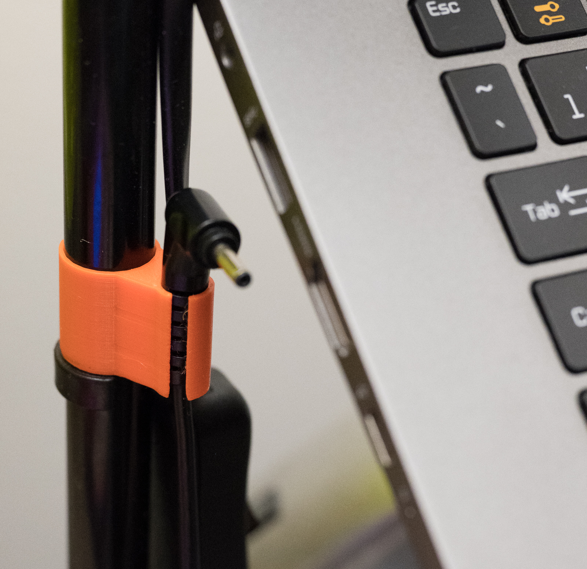
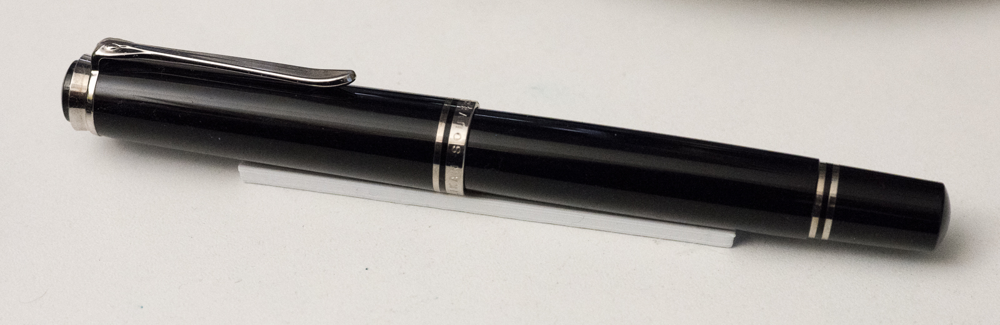
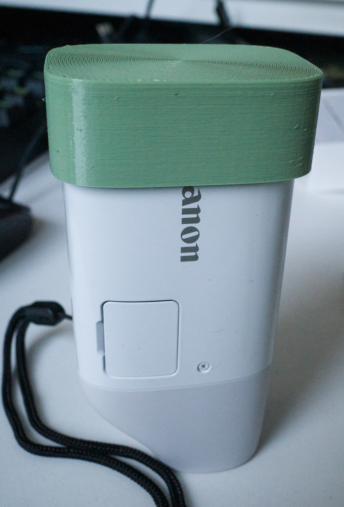
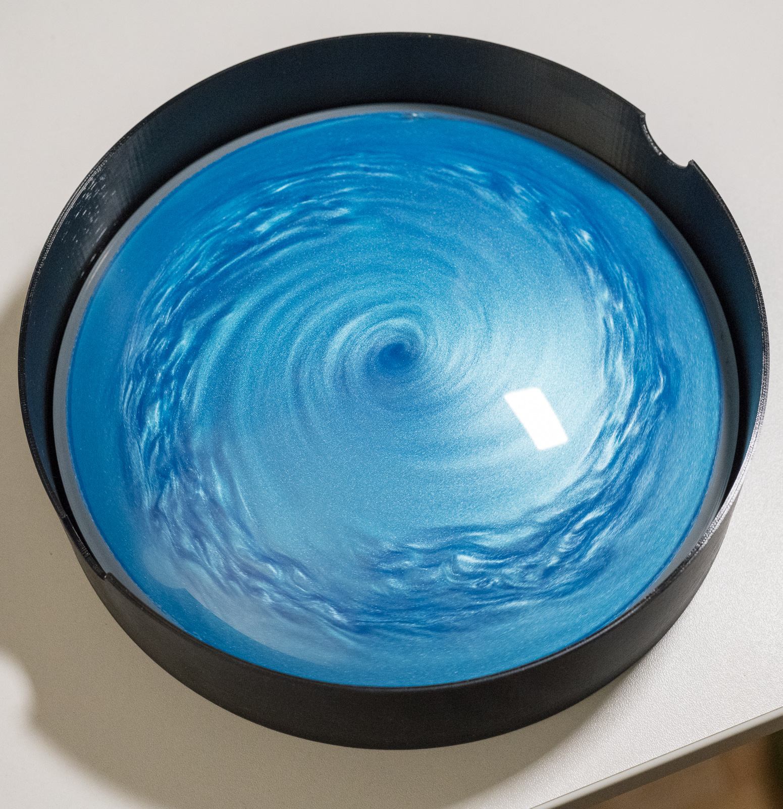
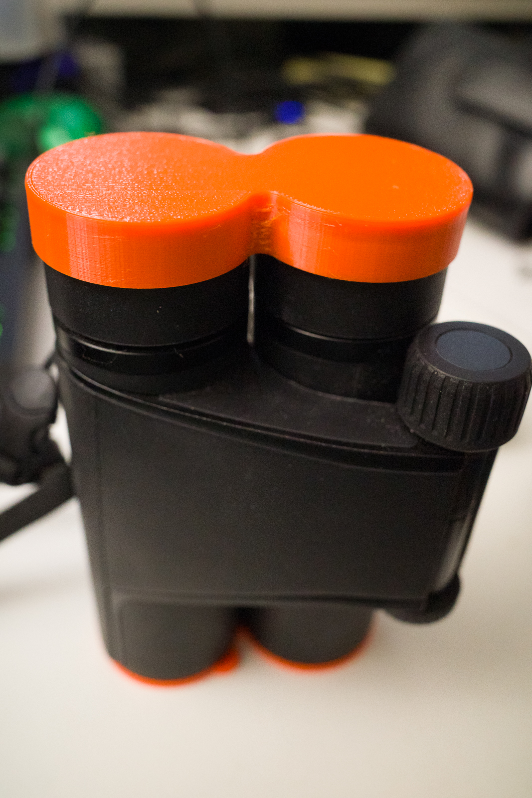
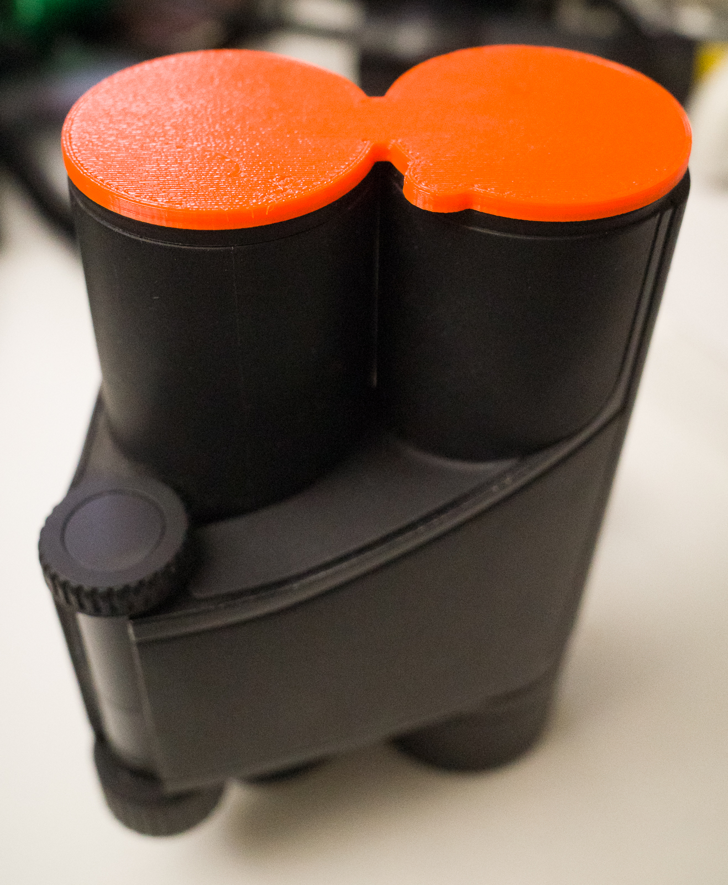

# 3D
Various 3D printing projects:

* `ikea_holder.stl` a little clip for an IKEA NOT uplighter lamp to hold a
  laptop charging plug. First-world problem, I know.
  

* `penholder.stl` a simple stand to hold a fountain pen on a flat surface so it
  doesn't roll over.
  

* `powershotzoom.{scad,stl}` objective lens cap for the Canon Powershot Zoom
  monocular/camera
  

* `vortexbox.{scad,stl}` a box to hold my [Vortex
  Dome](https://physicshack.com/product/vortex-dome/). It has a holder to keep
  the ball bearing foot stable, and just enough clearance so you can spin it
  while it is still in the box.

  Just about fits on my Prusa i3 MK3S (you need to go into advanced settings
  and set the skirt loops option to 0, as a skirt would not fit within the
  21x25cm work area). Print using PETG, 0.2mm Quality for best results. Also
  set the top and bottom fill patterns to `Archimedean chord` or `concentric`
  to avoid unseemly seams.
  

* `vortexlid.{scad,stl}` matching lid for the vortex dome box

  Same settings as the box.

* `zeiss_ep.stl` eyepiece cover for the Zeiss Victory Pocket 8x25 binoculars.

  Use PETG at the 0.10mm Detail setting.
  
  
* `zeiss_obj.stl` objective cover for the Zeiss Victory Pocket 8x25 binoculars.

  Use PETG at the 0.10mm Detail setting.
  
  
